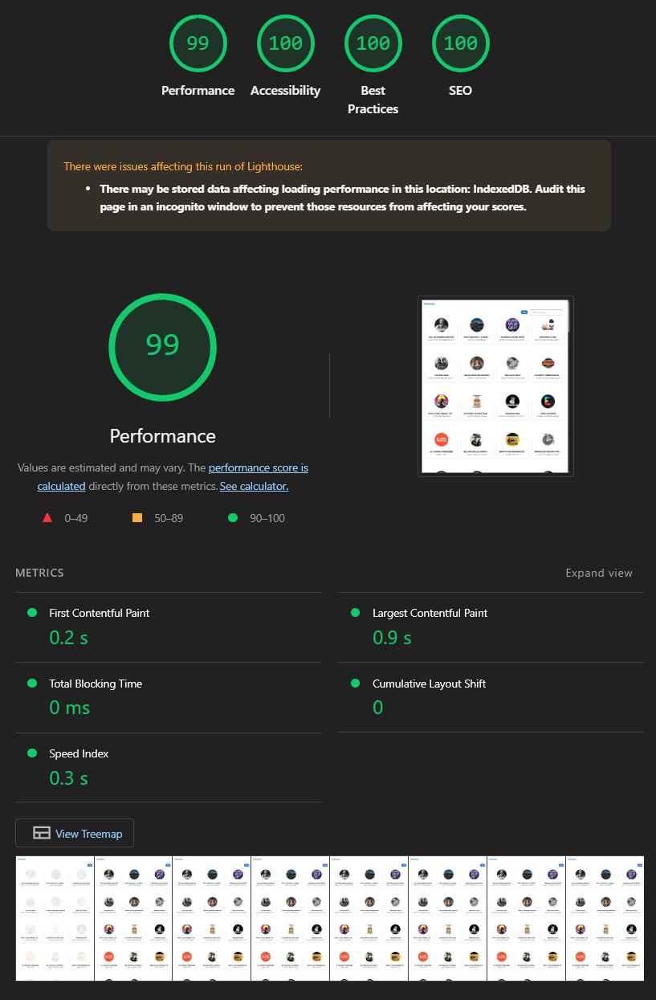

# Frontend Technical Test - Podcast App

This is a solution for the frontend technical test. It's a Next.js application that allows users to browse the top 100 most popular podcasts from the iTunes API.

## Features

- **Podcast List**: Displays the top 100 podcasts.
- **Filtering**: Users can filter podcasts by title or author in real-time on the main list.
- **Podcast Detail**: Shows detailed information about a selected podcast, including its episode list.
- **Episode Player**: Allows users to play a selected podcast episode.
- **Declarative Loading with Suspense**: Uses React `Suspense` for handling loading states declaratively. This includes:
    - A global indicator in the header for any background data fetching.
    - Skeleton loaders for images and content sections to prevent layout shifts.
    - A full-page loader for the initial application load.
- **Error Handling**: A custom `ErrorBoundary` component catches rendering errors and displays a fallback UI, preventing the entire application from crashing.
- **Caching Strategy**: Implements a two-layer caching system for optimal performance:
    - **In-Memory Cache**: A `Map` caches Suspense resources during the session to prevent re-fetching on component re-renders.
    - **Service Worker Cache**: A PWA Service Worker caches network responses to speed up subsequent visits and enable offline access. API data is cached for 24 hours, and images for 1 year.
- **Image Optimization**: A custom `<Image>` component with `Suspense` and `srcset` serves appropriately sized images and displays a skeleton loader.
- **Responsive Design**: The layout adapts to different screen sizes.
- **Dynamic Page Titles**: The document title updates dynamically based on the current view for better user experience and SEO.

## Tech Stack

- **Framework**: Next.js (App Router)
- **Language**: TypeScript
- **Styling**: Tailwind CSS
- **State Management**: React Context API and `useSyncExternalStore` for global state management, combined with React `Suspense` for declarative loading states.
- **Data Fetching**: Native `fetch` API integrated with Next.js Server Components and caching mechanisms.
- **Testing**: Jest and React Testing Library for unit and integration tests.

## Architecture and Design Patterns

The project is structured following the principles of **Feature-Sliced Design (FSD)**, a scalable architectural methodology for frontend applications. This approach organizes the codebase into layers and slices, promoting low coupling and high cohesion.

### FSD Layers

- **app**: The composition layer. It initializes the application, wires up providers (like `LoadingProvider`), defines global styles, and contains the root layout.
- **widgets**: Complex, compositional UI blocks for pages (e.g., `Header`, `PodcastList`). They assemble features and entities into meaningful sections of the interface.
- **features**: Slices of business logic that provide value to the user (e.g., `FilterPodcasts`).
- **entities**: Core business entities of the application (e.g., `PodcastCard`, `EpisodeDetail`). They are the most independent and reusable components.
- **shared**: Reusable code that is not tied to any specific business logic. This includes UI kits (`Image`, `ErrorBoundary`), libraries (`api-client`), hooks (`useLoading`), and type definitions.

### Design Patterns

Several design patterns have been implemented to create a robust and maintainable solution:

- **Server & Client Component Architecture**: The application leverages the Next.js App Router to separate concerns effectively.
    - **Server Components** are the default and are used for data fetching (`getPodcasts`, `getPodcastDetails`) and rendering static UI. This minimizes the client-side JavaScript bundle and improves initial page load performance.
    - **Client Components** (`'use client'`) are used only where interactivity is essential (e.g., input filtering, click events, stateful hooks), ensuring a lean and performant user experience.

- **Observer Pattern (`LoadingManager`)**: A global loading state is managed using the Observer pattern. The `LoadingManager` class acts as the "subject," maintaining a map of loading states. UI components, like the `LoadingIndicator`, "subscribe" to this manager via the `useLoading` hook. When a state changes, the manager notifies all subscribers, causing them to update. This decouples the loading indicator from the components that trigger loading states, preventing prop drilling and unnecessary re-renders across the application.

- **Provider Pattern (Context API)**: The `LoadingProvider` utilizes the Provider pattern to make a single, stable instance of the `LoadingManager` available throughout the component tree. This ensures that all components share the same source of truth for loading states.

- **Hook Pattern (`useLoading`)**: The `useLoading` custom hook encapsulates the logic for interacting with the `LoadingContext` and `useSyncExternalStore`. This provides a clean, reusable, and declarative API for components to read and write to the global loading state, abstracting away the underlying implementation details.

- **Error Boundary Pattern**: The application uses a custom `ErrorBoundary` component, a standard React pattern, to catch rendering errors in its children. This prevents a UI crash in one part of the application (e.g., a failed data fetch in a sub-component) from breaking the entire page, providing a more resilient user experience with an option to retry the failed action.

- **Cache-Aside Pattern**: A simple server-side in-memory cache (`podcastCache` in `itunes-api.ts`) is used to implement the cache-aside pattern. After the initial fetch of the podcast list, the data is stored. Subsequent requests for podcast details on the server can read from this cache to get summary information, avoiding redundant network calls and reducing latency.

## Getting Started

### Prerequisites

- Node.js (v18 or later)
- npm or yarn

### Installation & Running

1.  Clone the repository:
    ```bash
    git clone <repository-url>
    cd <repository-directory>
    ```

2.  Install dependencies:
    ```bash
    npm install
    # or
    yarn install
    ```

3.  Run the development server:
```bash
npm run dev
# or
yarn dev
```

Open [http://localhost:3000](http://localhost:3000) with your browser to see the result.

You can start editing the page by modifying `app/page.tsx`. The page auto-updates as you edit the file.

This project uses [`next/font`](https://nextjs.org/docs/app/building-your-application/optimizing/fonts) to automatically optimize and load [Geist](https://vercel.com/font), a new font family for Vercel.

## Learn More

To learn more about Next.js, take a look at the following resources:

- [Next.js Documentation](https://nextjs.org/docs) - learn about Next.js features and API.
- [Learn Next.js](https://nextjs.org/learn) - an interactive Next.js tutorial.

You can check out [the Next.js GitHub repository](https://github.com/vercel/next.js) - your feedback and contributions are welcome!

## Performance
### Lighthouse


### Screens
#### Desktop


#### Mobile


#### Loading
