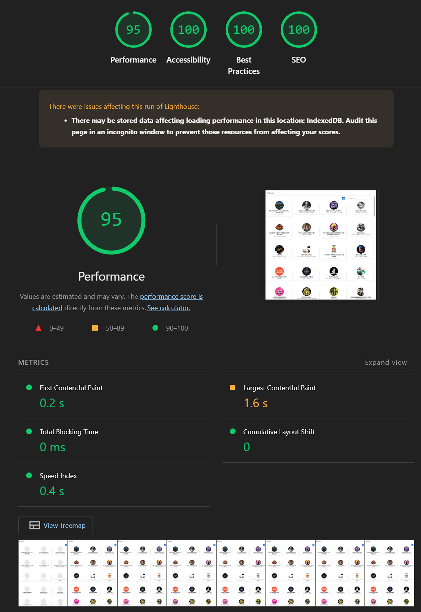
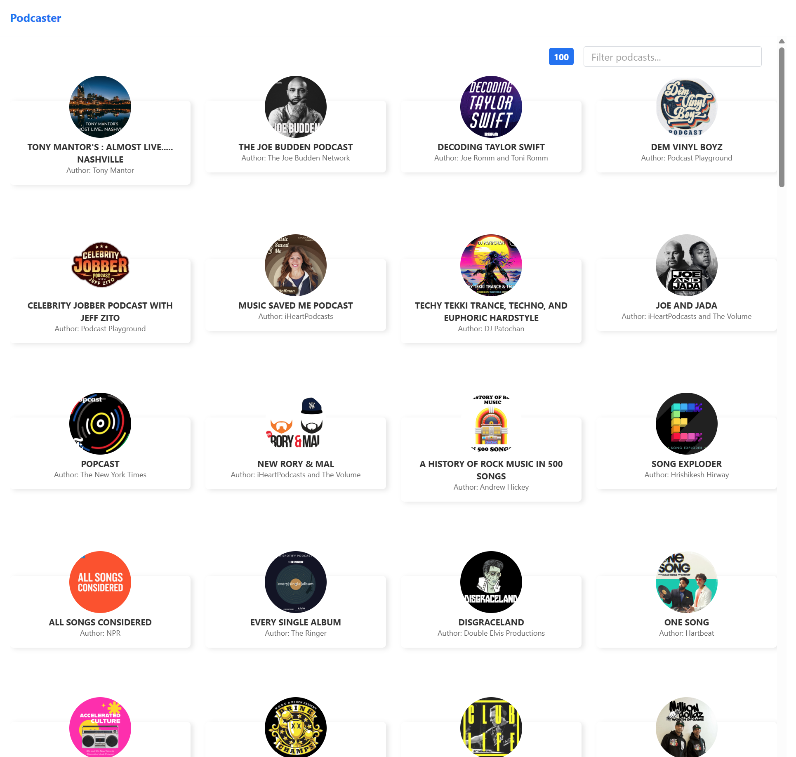
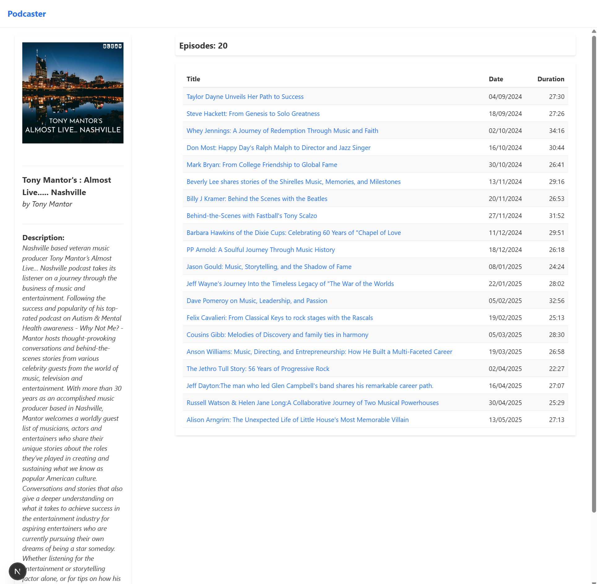
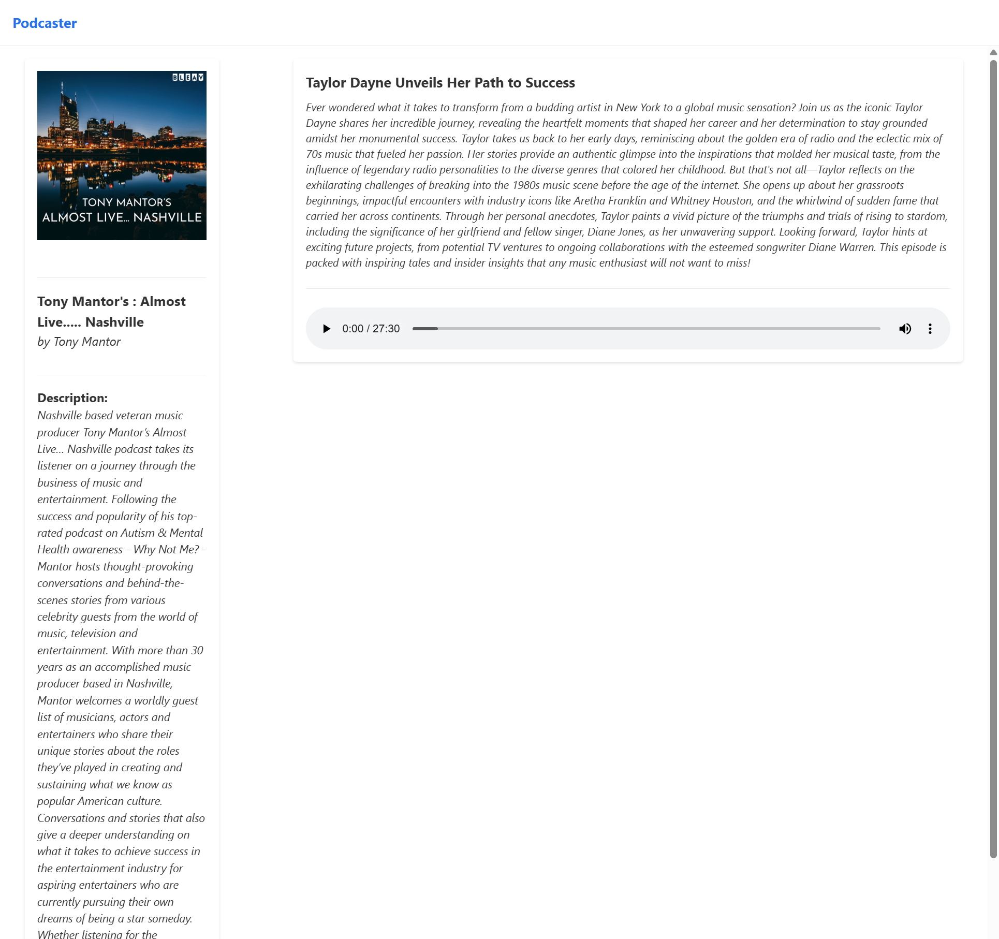
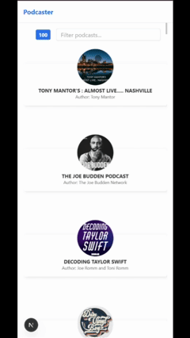
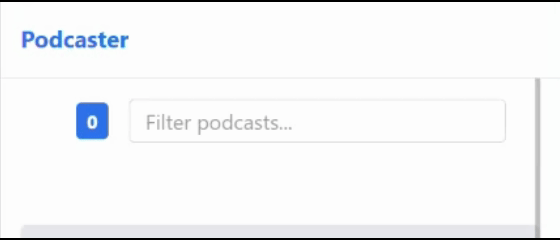

# Frontend Technical Test - Podcast App

This is a solution for the frontend technical test. It's a Next.js application that allows users to browse the top 100 most popular podcasts from the iTunes API.

## Features

- **Podcast List**: Displays the top 100 podcasts.
- **Filtering**: Users can filter podcasts by title or author in real-time on the main list.
- **Podcast Detail**: Shows detailed information about a selected podcast, including its episode list.
- **Episode Player**: Allows users to play a selected podcast episode.
- **Declarative Loading with Suspense**: Uses React `Suspense` for handling loading states declaratively. This includes:
    - A global indicator in the header for any background data fetching.
    - Skeleton loaders for images and content sections to prevent layout shifts.
    - A full-page loader for the initial application load.
- **Error Handling**: A custom `ErrorBoundary` component catches rendering errors and displays a fallback UI, preventing the entire application from crashing.
- **Caching Strategy**: Implements a two-layer caching system for optimal performance:
    - **In-Memory Cache**: A `Map` caches Suspense resources during the session to prevent re-fetching on component re-renders.
    - **Service Worker Cache**: A PWA Service Worker caches network responses to speed up subsequent visits and enable offline access. API data is cached for 24 hours, and images for 1 year.
- **Image Optimization**: A custom `<Image>` component with `Suspense` and `srcset` serves appropriately sized images and displays a skeleton loader.
- **Responsive Design**: The layout adapts to different screen sizes.
- **Dynamic Page Titles**: The document title updates dynamically based on the current view for better user experience and SEO.

## Tech Stack

- **Framework**: Next.js (with App Router structure).
- **Language**: TypeScript
- **Styling**: Tailwind CSS
- **State Management**: React Context API for global state (like loading indicators) and `Suspense` for data-fetching states.
- **Data Fetching**: A custom `useSuspenseFetch` hook integrates the `fetch` API with React `Suspense` for a declarative data-fetching approach.
- **Testing**: Jest and React Testing Library for unit and integration tests.

## Architecture

The project follows a layered architecture to separate concerns and improve maintainability:
- **`components`**: Reusable UI components, including common elements and feature-specific ones.
- **`contexts`**: React Context definitions for global state.
- **`hooks`**: Custom React hooks for reusable logic (e.g., `useSuspenseFetch`, `useLoading`).
- **`providers`**: Context providers that encapsulate state logic and data fetching.
- **`services`**: Modules for interacting with external APIs and transforming data.
- **`types`**: Centralized TypeScript type definitions.

## Getting Started

### Prerequisites

- Node.js (v18 or later)
- npm or yarn

### Installation & Running

1.  Clone the repository:
    ```bash
    git clone <repository-url>
    cd <repository-directory>
    ```

2.  Install dependencies:
    ```bash
    npm install
    # or
    yarn install
    ```

3.  Run the development server:
```bash
npm run dev
# or
yarn dev
```

Open [http://localhost:3000](http://localhost:3000) with your browser to see the result.

You can start editing the page by modifying `app/page.tsx`. The page auto-updates as you edit the file.

This project uses [`next/font`](https://nextjs.org/docs/app/building-your-application/optimizing/fonts) to automatically optimize and load [Geist](https://vercel.com/font), a new font family for Vercel.

## Learn More

To learn more about Next.js, take a look at the following resources:

- [Next.js Documentation](https://nextjs.org/docs) - learn about Next.js features and API.
- [Learn Next.js](https://nextjs.org/learn) - an interactive Next.js tutorial.

You can check out [the Next.js GitHub repository](https://github.com/vercel/next.js) - your feedback and contributions are welcome!

## Performance
### Lighthouse


### Screens
#### Desktop



#### Mobile


#### Loading
